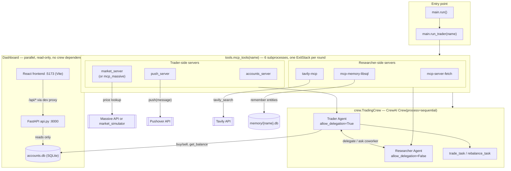

# Autonomous Traders (CrewAI) — Project Guide

This document explains what this project is, how every file and folder fits
together, and how to actually run it. It reflects the state of the project
as of the CrewAI migration (crew.py + main.py wired to real MCP servers) plus
the read-only FastAPI + React dashboard added afterward.

---

## 1. What this project is

An **autonomous trading floor**: one or more AI "traders" (Warren, George,
Ray, Cathie by convention) each hold a simulated brokerage account. On each
run, a trader:

1. Asks a **Researcher** agent (its teammate in the crew) to look up
   financial news and opportunities that fit its strategy.
2. Looks up share prices (real, via the Massive market-data API, or
   simulated, if no API key is set).
3. Decides what to buy/sell and executes trades against its own account.
4. Sends itself a push notification summarizing what it did.
5. Replies with a short appraisal of its portfolio.

This is a **CrewAI port** of an original implementation that used the
OpenAI Agents SDK (that original lives alongside this repo at
`6_mcp/backend/`, and is referenced throughout this doc as "the original").
The porting philosophy was: keep the domain logic (accounts, market data)
almost byte-for-byte identical, and rebuild the *agent orchestration* layer
using CrewAI's idioms (`Agent`, `Task`, `Crew`, `@CrewBase`, delegation)
instead of the Agents SDK's (`Agent.as_tool()`, `MCPServerStdio`,
`AsyncExitStack`).

Trading itself is **not real** — no brokerage is involved. "Buying" and
"selling" shares just update numbers in a local SQLite file
(`accounts.db`). It's a simulation/sandbox for autonomous agent behavior.

Alongside the crew, there's now a **read-only dashboard**: a FastAPI layer
(`api.py`) that exposes `accounts.db` as JSON, and a React + TypeScript
frontend (`frontend/`) that polls it to show each trader's portfolio value
over time, holdings, recent trades and activity log, live. It only reads —
trading still only happens when `main.run_trader()` executes a crew round.

---

## 2. Directory structure

```
autonomous_traders_crewai/
├── .env                          # secrets & config (API keys, model name) — gitignored
├── .gitignore
├── AGENTS.md                     # auto-generated CrewAI reference for AI coding assistants
├── README.md                     # original crewai-scaffold README (now partly stale, see §7)
├── PROJECT_GUIDE.md              # this file
├── pyproject.toml                # project metadata, dependencies, CLI entry points
├── uv.lock                       # locked dependency versions (generated by `uv`)
├── accounts.db                   # SQLite file — trader account state (created at runtime)
├── memory/                       # per-trader knowledge-graph databases (created at runtime)
│   └── Warren.db
├── knowledge/
│   └── user_preference.txt       # CrewAI "knowledge source" scaffold example (unused by the crew)
├── .venv/                        # local virtual environment created by `uv` (gitignored)
├── frontend/                      # React + TypeScript dashboard (Vite)
│   ├── package.json               # react, vite, @vitejs/plugin-react, typescript
│   ├── tsconfig.json
│   ├── vite.config.ts             # dev server + /api -> FastAPI proxy config
│   ├── index.html                 # entry HTML, mounts <App/> into #root
│   ├── node_modules/               # installed by `npm install` (gitignored)
│   ├── dist/                       # production build output (gitignored, created by `npm run build`)
│   └── src/
│       ├── main.tsx                # ReactDOM.createRoot(...).render(<App/>)
│       ├── App.tsx                 # top-level layout: Sidebar + grid of TraderPanels
│       ├── api.ts                  # typed fetch wrappers for the FastAPI endpoints
│       ├── styles.css              # the whole design system: palette, layout, components
│       ├── hooks/
│       │   ├── useInterval.ts       # fixed-delay polling helper
│       │   ├── useTheme.ts          # dark/light state, persisted, drives data-theme attr
│       │   ├── useResizeObserver.ts # tracks an element's size for the chart's SVG
│       │   └── useTradingFloor.ts   # polls every trader's data+logs, builds chart history
│       └── components/
│           ├── Sidebar.tsx          # brand, market badge, returns leaderboard, theme toggle
│           ├── TraderPanel.tsx      # one trader's quadrant: header + chart + heatmap + bottom row
│           ├── PortfolioChart.tsx   # hand-rolled SVG line+area chart with hover crosshair/tooltip
│           ├── Heatmap.tsx          # holdings tiles, sized by value, flashing on price ticks
│           ├── ActivityLog.tsx      # per-trader account activity feed
│           └── Transactions.tsx     # per-trader recent trades list
└── src/
    └── autonomous_traders_crewai/
        ├── __init__.py           # empty — marks this as a regular package
        ├── main.py                # entry points: run(), train(), replay(), test(), run_with_trigger()
        ├── crew.py                # TradingCrew: builds the researcher+trader Agents/Task/Crew
        ├── api.py                 # read-only FastAPI app the dashboard talks to
        ├── config/
        │   ├── agents.yaml        # role/goal/backstory templates for researcher & trader
        │   └── tasks.yaml         # description/expected_output templates for trade & rebalance tasks
        ├── domain/                # pure business logic — no CrewAI/MCP imports here
        │   ├── accounts.py        # Account model: balance, holdings, buy/sell, strategy
        │   ├── database.py        # tiny SQLite wrapper accounts.py sits on top of
        │   ├── market.py          # get_share_price() — live (Massive) or simulated
        │   └── market_simulator.py# deterministic fake price generator (no API key path)
        └── tools/                 # MCP servers + the adapter that wires them into CrewAI
            ├── __init__.py        # empty
            ├── custom_tool.py     # unused CrewAI-scaffold example tool (see §7)
            ├── accounts_server.py # FastMCP server exposing Account as tools or a trader
            ├── push_server.py     # FastMCP server: sends a Pushover notification
            ├── market_server.py   # FastMCP server: lookup_share_price (simulated-price fallback)
            └── mcp_tools.py       # MCPServerAdapter wiring: starts all servers, hands out tools
```

---

## 3. File-by-file explanation

### Root files

| File | Purpose |
|---|---|
| `.env` | All secrets and runtime config: `MODEL`, `OPENAI_API_KEY`/`OPENAI_BASE_URL` (or `AICREDITS_*`), `MASSIVE_API_KEY`, `PUSHOVER_USER`/`PUSHOVER_TOKEN`, `TAVILY_API_KEY`. Loaded via `python-dotenv`'s `load_dotenv(override=True)` in several modules. **Never commit this file** — it's in `.gitignore`. |
| `.gitignore` | Excludes `.env`, `__pycache__/`, `.DS_Store`, `accounts.db`, `memory/`, and `frontend/node_modules/` + `frontend/dist/` — i.e. secrets and generated state, not source code. |
| `pyproject.toml` | Declares the package, its dependencies (`crewai[tools]`, `crewai-tools[mcp]`, `massive`, `fastapi`, `uvicorn`), and the CLI entry points (`run_crew`, `train`, `replay`, `test`, `run_with_trigger`) that map to functions in `main.py`. `[tool.crewai] type = "crew"` marks this as a Crew project for CrewAI's own tooling. |
| `uv.lock` | Exact resolved dependency versions, generated by `uv`. Commit this so everyone (and CrewAI AMP deployment) gets identical installs. |
| `AGENTS.md` | Auto-generated by `crewai create`. A reference doc *for AI coding assistants* (like me) on current CrewAI APIs/patterns — not project-specific, just upstream framework documentation kept alongside the code so an assistant doesn't rely on stale training data. |
| `README.md` | The default scaffold README from `crewai create`. It still describes the generic "research a topic → write report.md" example project and hasn't been updated for the trading domain — see §7 for what's stale. |
| `accounts.db` | SQLite database holding every trader's account JSON blob + an audit log. Created automatically the first time any trader account is read or written. Safe to delete to reset all accounts to a fresh $10,000 balance. |
| `memory/` | One SQLite file per trader (`memory/Warren.db`, etc.), used by the Researcher's knowledge-graph tool (`mcp-memory-libsql`) to remember entities (companies, websites, market conditions) across runs. Created automatically by `tools/mcp_tools.py`. |
| `knowledge/user_preference.txt` | Leftover from the `crewai create` scaffold — demonstrates CrewAI's "knowledge source" feature. It's not attached to any agent in `crew.py`, so it currently has no effect. Harmless to keep, ignore, or delete. |
| `.venv/` | The Python virtual environment `uv` creates the first time you `uv run` something in this project. Contains your interpreter + all installed packages. Never edit by hand; delete and let `uv` recreate it if it gets corrupted. |

### `src/autonomous_traders_crewai/` (the package)

- **`__init__.py`** — empty. Its only job is to make `autonomous_traders_crewai` an importable Python package (so `from autonomous_traders_crewai.crew import TradingCrew` works).

- **`main.py`** — the program's entry points (what actually gets run):
  - `_inputs_for(name)` — builds the `inputs` dict (`name`, `note`, `strategy`, `account`, `current_datetime`) that CrewAI interpolates into the `{placeholders}` in `agents.yaml`/`tasks.yaml`.
  - `run_trader(name, do_trade=True)` — the core function: opens all MCP servers for one trader via `mcp_tools(name)`, builds a `TradingCrew`, and calls `.kickoff()`. Everything else calls this.
  - `run()` — loops over `TRADER_NAMES = ["Warren", "George", "Ray", "Cathie"]` and runs one trading round for each. This is what `uv run run_crew` executes.
  - `train()`, `replay()`, `test()` — thin wrappers around CrewAI's built-in `Crew.train()/.replay()/.test()` dev tools, run against Warren by default.
  - `run_with_trigger()` — for CrewAI AMP's webhook-trigger deployment mode; runs one round for the first trader.

- **`crew.py`** — the crew definition:
  - `NOTE` — a constant string telling the trader whether it has live (Massive) or simulated market data, computed once from `domain.market.massive_api_key`.
  - `TradingCrew` (`@CrewBase`) — built **fresh per trading round** (not a long-lived singleton), because its tools are live MCP subprocess connections:
    - `__init__(trader_tools, researcher_tools, do_trade, model_name)` — stores the tool lists (handed in from `mcp_tools()`) and which task to run.
    - `researcher()` (`@agent`) — an `Agent` with `allow_delegation=False`, given the researcher's MCP tools (fetch, Tavily search, memory).
    - `trader()` (`@agent`) — an `Agent` with `allow_delegation=True` (so it can ask the researcher for help via CrewAI's built-in "ask a coworker" delegation), given the trader's MCP tools (accounts, push, market/Massive).
    - `current_task()` (`@task`) — returns either the `trade_task` or `rebalance_task` config, depending on `self.do_trade`.
    - `crew()` (`@crew`) — assembles `Agent`s + the one selected `Task` into a `Crew(process=Process.sequential)`.

- **`api.py`** — a **read-only** FastAPI app for the dashboard, entirely separate from the crew (it never imports `crew.py` or `mcp_tools.py`, and never writes anything):
  - `roster` — `TRADER_NAMES` (imported from `main.py`, so there's one source of truth) zipped with flavor-text lastnames (`Patience`/`Bold`/`Systematic`/`Crypto`) and the `MODEL` env var, purely for display.
  - `holdings_detail(account)` / `average_cost(account, symbol)` — enrich each holding with live price, average cost basis and unrealized P&L (average cost is derived from the buy-side transaction history, not stored directly).
  - `GET /api/traders` — the roster. `GET /api/market` — `{source, is_market_open}` from `domain.market`. `GET /api/traders/{name}` — full account detail (balance, strategy, portfolio value, P&L, holdings, transactions, portfolio-value time series). `GET /api/traders/{name}/logs` — recent rows from the `logs` table, colour-coded by type.
  - Run it with `uv run uvicorn autonomous_traders_crewai.api:app --app-dir src --port 8000` (see §6).

- **`config/agents.yaml`** — role/goal/backstory text for `researcher` and `trader`, with `{name}`, `{note}`, `{current_datetime}` placeholders filled in at `kickoff(inputs=...)` time.

- **`config/tasks.yaml`** — `trade_task` and `rebalance_task`: the actual instructions given each round (look for opportunities vs. review existing holdings), with `{name}`, `{note}`, `{strategy}`, `{account}`, `{current_datetime}` placeholders.

- **`domain/`** — pure business logic, no CrewAI or MCP imports (this is what makes it portable between the original Agents-SDK version and this CrewAI version — this folder is almost a direct copy):
  - `accounts.py` — the `Account` pydantic model: `balance`, `holdings`, `strategy`, `transactions`. Methods `buy_shares`/`sell_shares` apply a small bid/ask `SPREAD` (0.2%), reject trades that would overdraw the balance, and persist via `database.py`. `report()` returns the full account state as a JSON string (this is what gets fed into the trader's prompt as `{account}`).
  - `database.py` — a minimal SQLite wrapper (`accounts` and `logs` tables) that `accounts.py` sits on top of. **Note:** `DB = "accounts.db"` is a *relative* path, so it resolves against whatever directory the process was started from. All the MCP servers below are always launched with `cwd` pinned to the project root, so they consistently use `<project-root>/accounts.db` — but if you run a one-off script by hand, run it from the project root too, or you'll silently read/write a different file.
  - `market.py` — `get_share_price(symbol)`: tries the Massive REST API (if `MASSIVE_API_KEY` is set), falling back through progressively cheaper endpoints (`last_trade` → `snapshot` → `previous_close`) to work around plan-tier limits, and falls back to `market_simulator.simulated_price()` if Massive is unavailable or no key is set. Also exposes `is_market_open()`.
  - `market_simulator.py` — generates a deterministic, smoothly-varying fake price for any ticker (seeded by the ticker name + timestamp via layered noise), so the whole system works out of the box with zero API keys.

- **`tools/`** — the MCP layer: standalone MCP *servers* (subprocess programs) plus the *adapter* that starts them and turns their tools into CrewAI `BaseTool` objects:
  - `accounts_server.py` — a `FastMCP` server wrapping `domain.accounts.Account` as MCP tools: `get_balance`, `get_holdings`, `buy_shares`, `sell_shares`, `change_strategy`, plus two resources (`accounts://accounts_server/{name}`, `accounts://strategy/{name}`, not currently read by anything in this CrewAI version — they were used by the original's `accounts_client.py`).
  - `push_server.py` — a `FastMCP` server with one tool, `push(message)`, that posts to the Pushover API using `PUSHOVER_USER`/`PUSHOVER_TOKEN`.
  - `market_server.py` — a `FastMCP` server with one tool, `lookup_share_price(symbol)`, wrapping `domain.market.get_share_price`. Only used when `MASSIVE_API_KEY` is **not** set (see `mcp_tools.py` below).
  - `mcp_tools.py` — the piece that actually wires MCP into CrewAI. This is the most important file to understand:
    - Uses `crewai_tools.MCPServerAdapter` + `mcp.StdioServerParameters` to launch each server as a subprocess and expose its tools.
    - `_trader_server_params()` — accounts + push + (Massive's own `mcp_massive` server via `uvx`, if `MASSIVE_API_KEY` is set, else our local `market_server`).
    - `_researcher_server_params(name)` — `uvx mcp-server-fetch` (fetch web pages), `npx tavily-mcp@latest` (filtered down to just the `tavily_search` tool), and `npx mcp-memory-libsql` (per-trader knowledge graph, database at `memory/{name}.db`).
    - `_memory_dir()` — resolves an **absolute** path for `memory/` under the project root and creates the directory if missing (a real bug was hit here during testing: `mcp-memory-libsql` cannot create its db file if the parent directory doesn't exist).
    - `mcp_tools(name)` — a context manager. Because `MCPServerAdapter.__init__` starts its subprocess immediately, this function opens **all six** servers through one `contextlib.ExitStack`, `yield`s `(trader_tools, researcher_tools)` for the crew to use, then stops every subprocess on exit — one clean batch of six MCP subprocesses per trading round, not one held open for the app's whole lifetime.
  - `custom_tool.py` — the placeholder example tool `crewai create` scaffolds into every new project (`MyCustomTool`). It isn't used anywhere in this crew; it's just sitting there as a template if you ever want to write a plain custom (non-MCP) tool. Safe to delete or repurpose.

### `frontend/` (the React dashboard)

A standalone Vite + React + TypeScript app — it only talks to `api.py` over HTTP, so it has no dependency on CrewAI, Python, or MCP at all. No chart library is used; the portfolio chart is hand-rolled SVG.

- **`api.ts`** — typed `fetch` wrappers (`getTraders`, `getTrader`, `getTraderLogs`, `getMarket`) and the response types (`TraderInfo`, `TraderDetail`, `Holding`, `Transaction`, `LogRow`, `MarketInfo`) — the single place that knows the backend's JSON shape.
- **`hooks/useInterval.ts`** — ticks a callback on a fixed delay without resetting the timer when the callback identity changes (standard React interval pattern).
- **`hooks/useTheme.ts`** — dark/light state persisted to `localStorage`, applied as `document.documentElement.dataset.theme` so `styles.css`'s `:root[data-theme="..."]` blocks pick it up.
- **`hooks/useResizeObserver.ts`** — reports an element's content-box size; `PortfolioChart` uses this because its CSS-grid cell has no intrinsic size for an SVG to fill on its own.
- **`hooks/useTradingFloor.ts`** — the core data hook, centralised in `App.tsx` (not one poll loop per panel) so leader/returns calculations can compare across traders:
  - Polls `getTrader` for every trader every 6s and `getTraderLogs` every 2s (`Promise.all`, in parallel).
  - Seeds each trader's chart once from `time_series` (the account's stored history), then appends one live point per poll, capped at 5000 points.
  - Diffs each holding's price against the previous poll to produce `priceDirections` (`up`/`down`/`same`), which drives the heatmap's flash animation.
- **`components/PortfolioChart.tsx`** — the line+gradient-area chart: computes its own x/y scales (padding a single-point series to a 5-minute window so it doesn't auto-zoom to nothing), draws y-axis gridlines/labels and x-axis time ticks, colors the line/fill green or red by whether the series is up since its first point, and tracks mouse position over an invisible overlay `<rect>` to show a crosshair + a floating tooltip (value + time) at the nearest point.
- **`components/Heatmap.tsx`** — one tile per holding, `flex-grow` proportional to market value, tinted green/red by unrealized P&L. On a price tick it flashes brighter for 600ms; the tile is keyed by a per-symbol counter that increments on every tick, so React remounts it and restarts the CSS animation even when the same direction repeats on back-to-back polls (a plain CSS class toggle wouldn't replay the animation in that case).
- **`components/ActivityLog.tsx`** / **`components/Transactions.tsx`** — simple scrolling lists (auto-scrolled to the newest log line; trades shown newest-first, capped at 12 rows).
- **`components/Sidebar.tsx`** — brand header, the market-data badge (live/simulated + open/closed), a returns leaderboard sorted by % gain (computed from each trader's `pnl` vs. its implied starting value), and the theme toggle button.
- **`components/TraderPanel.tsx`** — composes one trader's whole quadrant: name/model/lastname, big portfolio value (colored by trend) + P&L, strategy text (or "No strategy set yet" placeholder), the chart, the heatmap, and a bottom row of activity log + transactions. Gets `data-leader="true"` (a gold ring, via CSS) when it's the single trader with the highest portfolio value — no highlight if there's a tie.
- **`App.tsx`** — fetches the roster and market info once on mount, runs `useTradingFloor`, computes the unique leader, and renders `<Sidebar/>` + a `<TraderPanel/>` grid (CSS grid, `repeat(auto-fit, minmax(560px, 1fr))`, so it's a clean 2×2 for four traders but reflows to fewer columns on a narrower window or more traders).
- **`styles.css`** — one file, the whole design system: CSS custom properties for the dark/light palettes (`--bg`, `--fg`, `--trend-up`/`--trend-down`, etc. — the trend green was tuned to `#22a06b` so it passes automated lightness/contrast/colorblind-separation checks against both the dark and light chart surfaces), the sidebar, the panel grid, and every component class referenced above.

---

## 4. About `__pycache__`

You'll see folders like `src/autonomous_traders_crewai/__pycache__/` and
`src/autonomous_traders_crewai/domain/__pycache__/` scattered around. These
are **not something you wrote or need to manage**:

- Every time Python imports a `.py` file, it compiles it to bytecode and
  caches that compiled form as a `.pyc` file inside a `__pycache__/`
  directory next to the source, named like
  `accounts.cpython-312.pyc` (`cpython-312` = "compiled for CPython 3.12").
- This is purely a **speed optimization**: next time that module is
  imported and the source hasn't changed, Python loads the cached bytecode
  instead of re-parsing and re-compiling the `.py` file.
- They are **generated automatically**, are **specific to your Python
  version**, and are **safe to delete at any time** — Python just
  regenerates them on the next import. They should never be committed to
  git (this project's `.gitignore` already excludes `__pycache__/`).
- If you ever see genuinely confusing behavior (edited a file but old
  behavior persists), deleting the relevant `__pycache__` folder and
  re-running is a reasonable (though rarely necessary — Python checks
  file-modification timestamps) troubleshooting step.

---

## 5. How the pieces connect at runtime

```
main.run()
  └─ for each trader name:
       main.run_trader(name)
         └─ tools.mcp_tools.mcp_tools(name):        # context manager
              starts 6 subprocesses via MCPServerAdapter:
                trader side:      accounts_server, push_server, market_server (or mcp_massive)
                researcher side:  mcp-server-fetch, tavily-mcp, mcp-memory-libsql
              yields (trader_tools, researcher_tools)
         └─ crew.TradingCrew(trader_tools, researcher_tools, do_trade=True)
              .crew()                                # @CrewBase assembles:
                 researcher Agent  (researcher_tools, allow_delegation=False)
                 trader Agent      (trader_tools,     allow_delegation=True)
                 one Task          (trade_task or rebalance_task, assigned to trader)
              .kickoff(inputs={name, note, strategy, account, current_datetime})
                 -> CrewAI interpolates {placeholders} into agent/task text
                 -> sequential process runs the one Task
                 -> trader Agent reasons, delegates research to the researcher
                    as needed (CrewAI's built-in "ask/delegate to coworker"),
                    looks up prices, buys/sells shares (mutates accounts.db),
                    sends a push notification, and returns a short appraisal
         └─ (context manager exit) all 6 subprocesses are stopped
```

Every call to `run_trader()` is a **self-contained round-trip**: fresh MCP
subprocesses, a fresh `TradingCrew`, one `kickoff()`, then full teardown.
Nothing is left running between rounds.

The dashboard is a completely separate, parallel read path — it doesn't
appear anywhere in the diagram above because it never touches the crew:

```
frontend (React, :5173)  --/api/*-->  Vite dev proxy  --> api.py (FastAPI, :8000)
                                                              └─ reads accounts.db directly
```

Whenever `run_trader()` (from a `uv run run_crew` or a scheduled call)
mutates `accounts.db` in the background, the next poll from the browser
(every 2–6s) picks up the change — there's no direct connection between the
two processes, just the shared SQLite file.

### Architecture diagram



Every trading round spins up the six MCP subprocesses and the crew fresh,
tears them all down on exit, and the only thing that outlives a round is
`accounts.db`. The dashboard never touches the crew or MCP layer at all —
it just polls that same SQLite file through `api.py`.

---

## 6. How to run it

### Prerequisites

- Python 3.10–3.13, with [`uv`](https://docs.astral.sh/uv/) installed (`pip install uv`).
- Node.js + `npx` available on PATH (needed for the Tavily search and memory MCP servers).
- `.env` filled in at the project root. At minimum you need:
  - `OPENAI_API_KEY` (or your configured provider's key + `OPENAI_BASE_URL`) and `MODEL`
  - `PUSHOVER_USER` / `PUSHOVER_TOKEN` (or the `push` tool calls will fail — Pushover accounts are free)
  - `TAVILY_API_KEY` (for the researcher's web search)
  - `MASSIVE_API_KEY` is **optional** — omit it and the system falls back to fully simulated prices with no external market-data dependency at all.
- Node.js + `npm` (for the dashboard's frontend only — not needed to run the crew itself).

### Run the dashboard

Two processes, in two terminals, both left running:

```bash
# Terminal 1, from the project root — the read-only API over accounts.db
uv run uvicorn autonomous_traders_crewai.api:app --app-dir src --port 8000 --reload

# Terminal 2, from frontend/ — installs once, then the Vite dev server
cd frontend
npm install
npm run dev
```

Open **http://localhost:5173**. The dev server proxies `/api/*` to the
FastAPI backend (see `frontend/vite.config.ts`), so the browser only ever
talks to one origin — no CORS setup needed. The dashboard works even with
an empty/fresh `accounts.db` (every trader just shows $10,000, no
holdings); run a trading round (below) in a third terminal to see it move.

To build a static production bundle instead of running the dev server:
`npm run build` (from `frontend/`) emits `frontend/dist/` — you'd need to
serve that directory yourself (e.g. FastAPI's `StaticFiles`, or any static
host) pointed at the same `api.py`; that wiring doesn't exist yet (see §7).

### Run one full round for every trader

From the project root (`autonomous_traders_crewai/`):

```bash
uv run run_crew
```

This calls `main.run()`, which runs one trade round for Warren, George, Ray
and Cathie in turn. Expect it to take a few minutes per trader (web
searches + multiple LLM calls + tool calls), and it **will** send real
Pushover notifications and mutate `accounts.db` for real (simulated money,
real file writes).

### Run just one trader, programmatically

```bash
uv run python -c "from autonomous_traders_crewai.main import run_trader; run_trader('Warren')"
```

Pass `do_trade=False` to run a **rebalance** round instead of a
new-opportunities round:

```bash
uv run python -c "from autonomous_traders_crewai.main import run_trader; run_trader('Warren', do_trade=False)"
```

### Check an account's state without running the crew

```bash
uv run python -c "from autonomous_traders_crewai.domain.accounts import Account; print(Account.get('warren').report())"
```

(Run this from the project root — see the `database.py` cwd caveat in §3.)

### Reset a trader back to $10,000 with no holdings

```bash
uv run python -c "from autonomous_traders_crewai.domain.accounts import Account; Account.get('warren').reset()"
```

### Other entry points (from `pyproject.toml`)

```bash
uv run train 5 training_output.json   # CrewAI's train loop, against Warren
uv run replay <task_id>               # replay a specific past task
uv run test 3 gpt-4o-mini             # CrewAI's test/eval loop, against Warren
```

### Inspecting the individual MCP servers directly (debugging)

Each server can be run standalone (it just waits on stdio, so this is
mostly useful to confirm it starts without errors — Ctrl+C to quit):

```bash
uv run -m autonomous_traders_crewai.tools.accounts_server
uv run -m autonomous_traders_crewai.tools.push_server
uv run -m autonomous_traders_crewai.tools.market_server
```

---

## 7. Known rough edges / things not (yet) done

- **`README.md` is stale.** It still describes the generic `crewai create`
  scaffold ("research a topic, write report.md"), not this trading system.
  Worth rewriting or replacing with a trimmed pointer to this guide.
- **No persistent scheduler.** The original project's `trading_floor.py`
  ran forever, re-running every N minutes and alternating trade/rebalance
  rounds, skipping runs while the market is closed. This CrewAI version's
  `main.run()` currently does a **single pass** over all four traders and
  exits — there's no loop, no `is_market_open()` check wired in yet, and no
  alternation between `do_trade=True`/`False` between successive calls.
- **`database.py`'s relative `"accounts.db"` path** is a footgun for
  anything invoked with a different working directory than the project
  root (see §3). It works today because every MCP server is launched with
  an explicit `cwd`, but it's fragile.
- **`knowledge/user_preference.txt`** and **`tools/custom_tool.py`** are
  unused scaffold leftovers — harmless, but not wired to anything.
- **Windows console encoding**: CrewAI's console output tries to print
  emoji (✨ 🤖 🔧) that Windows' default `cp1252` terminal encoding can't
  render, producing harmless `'charmap' codec can't encode character...`
  warnings in the log. Cosmetic only — doesn't affect execution. Can be
  silenced by setting `PYTHONIOENCODING=utf-8` before running, or via
  `chcp 65001` in the terminal.
- **The dashboard has no production deployment wiring.** `npm run build`
  produces `frontend/dist/`, but nothing serves it — there's no
  `StaticFiles` mount in `api.py` and no Dockerfile/reverse-proxy config.
  Fine for local dev (`npm run dev` + the Vite proxy); would need that
  wiring added before deploying anywhere.
- **The activity log is thinner than the original's.** The original's
  `backend/tracers.py` hooked into every OpenAI-Agents-SDK trace/agent/
  tool/LLM call and logged each one, giving its "Activity" panel a rich,
  colour-coded blow-by-blow feed. This CrewAI version only logs from
  `domain/accounts.py`'s own `write_log()` calls (buy/sell/strategy-change/
  report-read), so the feed shows real but coarser account activity, not
  the trader's or researcher's reasoning steps. CrewAI's own
  `crewai.events`/`BaseEventListener` system (see `AGENTS.md`'s "Event
  Listeners" section) could be wired up to log task/agent/tool events the
  same way, if that richer feed is wanted.
- **"Market open/closed" and the roster are fetched once**, not polled —
  matches the original's behavior, but means the badge won't update if the
  market opens/closes while the dashboard tab stays open; refresh the page
  to re-check.
- **`api.py`'s roster lastnames are cosmetic flavor text** (`Patience`/
  `Bold`/`Systematic`/`Crypto`), hardcoded in `api.py` itself rather than
  derived from anything — there's no per-trader personality data model
  elsewhere in the project (unlike the original's `trading_floor.py`,
  which owned this list and fed it into `Trader` objects directly).
